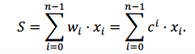

# weighted_sum
Description
================
This is an efficient method to get the lower and upper bounds of weighted sum of a series of data.
It is often very useful to apply a weighted sum over a series of data, in order to create a single scalar feature. Here, we define the weight to be wi=c^i. So that the weighted sum S can be presented as  

Install
================
